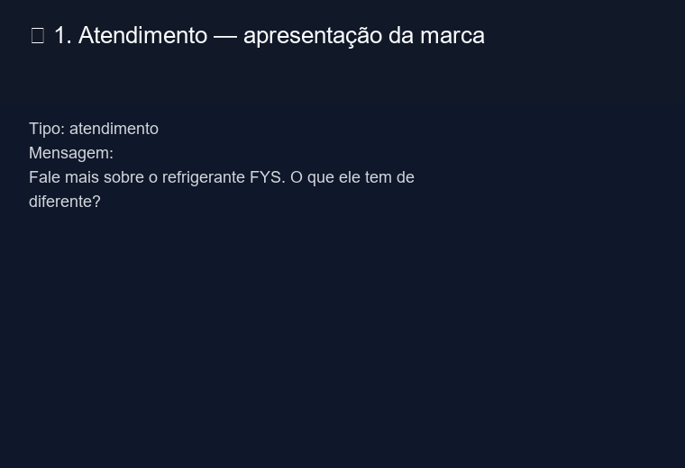

# Copiloto de Vendas com IA – FYS (Python)

  

Um copiloto de vendas prático para atendimento comercial: ajuda vendedores e equipes a entender o cliente, responder dúvidas, lidar com objeções e priorizar oportunidades com base em uma base de conhecimento real da FYS (grupo HEINEKEN).

## 🎬 Demonstração



## O que é este projeto?

Este repositório mostra uma implementação de IA para atendimento de vendas em Python com:

- prompts configuráveis em `src/prompts.py`
- carregamento de conhecimento em `src/knowledge_loader.py`
- fluxo CLI em `src/copiloto.py`
- base de conhecimento em `knowledge/`

## Para quem é?

Pessoas vendedoras, atendentes, equipes comerciais e qualquer projeto que deseje usar IA para:

- responder perguntas de clientes
- organizar argumentos comerciais
- sugerir próximas mensagens
- lidar com objeções
- priorizar clientes ou pontos de venda

## Problema que resolve

- Clientes não conhecem a marca FYS.
- Vendedores precisam de argumentos e respostas rápidas.
- Objeções exigem uma resposta alinhada ao posicionamento da marca.
- Decisões de priorização precisam ser mais rápidas e baseadas em contexto.

## Como funciona

1. `src/prompts.py` define o tom, as regras e o prompt do usuário.
2. `src/knowledge_loader.py` carrega os arquivos de `knowledge/` (.md e .txt) e monta a base de conhecimento.
3. `src/copiloto.py` solicita o tipo de interação e a mensagem do cliente e chama a API Groq.
4. A IA responde com:
   - entendimento do cliente
   - sugestão de resposta
   - apoio para o vendedor

## Exemplo real de uso

Entrada:

```bash
Tipo: objeção
Mensagem: Nunca ouvi falar dessa FYS, é boa mesmo?
```

Saída esperada:

```bash
=== RESPOSTA DO COPILOTO ===

1) Entendimento do cliente
- Ele nunca ouviu falar da FYS, portanto a principal dúvida é sobre a credibilidade e qualidade do produto.
- A necessidade dele é conhecer a marca e sentir segurança para experimentar, possivelmente comparando com marcas mais conhecidas.
- Implícito, ele pode estar buscando uma opção de refrigerante com menos açúcar ou zero, mas ainda não expressou isso.

2) Sugestão de resposta para o cliente
“Oi, tudo bem? A FYS é o refrigerante do grupo Heineken – a mesma galera que garante a qualidade da cerveja, mas sem a pretensão de ser a número 1 (a gente prefere rir disso). Nosso foco é oferecer sabor de verdade, com 50 % menos açúcar que a média do mercado, e ainda temos versões zero açúcar. Que tal provar um dos nossos sabores? Tenho certeza que você vai curtir a surpresa.”

3) Apoio à pessoa vendedora
- Ofereça imediatamente uma degustação: “Posso deixar uma lata de Guaraná da Amazônia ou Limão Siciliano para você experimentar agora mesmo.”
- Pergunte qual sabor costuma consumir: “Você prefere algo mais cítrico ou adocicado? Temos opções que se encaixam nos dois perfis.”
- Caso o cliente mencione preço, destaque promoções de primeira compra ou kits com preço promocional.
- Use a brincadeira da marca para contornar a falta de notoriedade: “Não somos a número 1, mas somos a escolha que faz todo mundo dar risada e ficar satisfeito.”
- Registre o interesse do cliente no CRM e marque um follow-up para saber se gostou da degustação, oferecendo um cupom de desconto para a próxima compra.
```

## Estrutura do projeto

- `src/copiloto.py` — interface CLI e chamada à API Groq.
- `src/prompts.py` — prompt principal e construção do prompt de usuário.
- `src/knowledge_loader.py` — carrega arquivos de `knowledge/` (.md e .txt) e monta o contexto.
- `knowledge/` — base de conhecimento da marca FYS.
- `examples/run_demo.py` — script de demonstração local.
- `examples/demo_output.gif` — GIF mostrando o fluxo de perguntas e respostas.

## Instalação rápida

Windows PowerShell:

```powershell
python -m venv .venv
.\.venv\Scripts\Activate.ps1
pip install -r requirements.txt
echo GROQ_API_KEY=sua_chave_aqui > .env
python src/copiloto.py
```

Bash/macOS:

```bash
python -m venv .venv
source .venv/bin/activate
pip install -r requirements.txt
echo "GROQ_API_KEY=sua_chave_aqui" > .env
python src/copiloto.py
```

## Melhorias futuras

- Adicionar API REST ou interface web.
- Criar integração com WhatsApp ou chat.
- Registrar histórico de conversas para aprendizado contínuo.
- Adicionar badge "Try it" e GitHub Actions para testes.